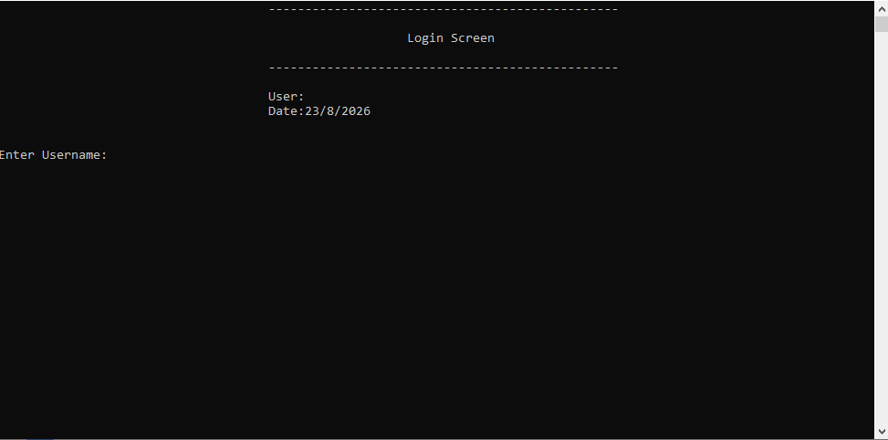
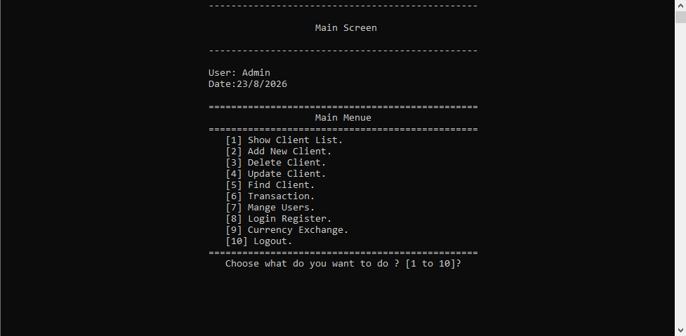
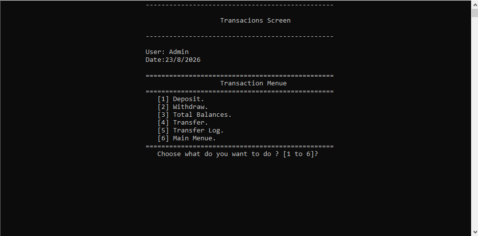
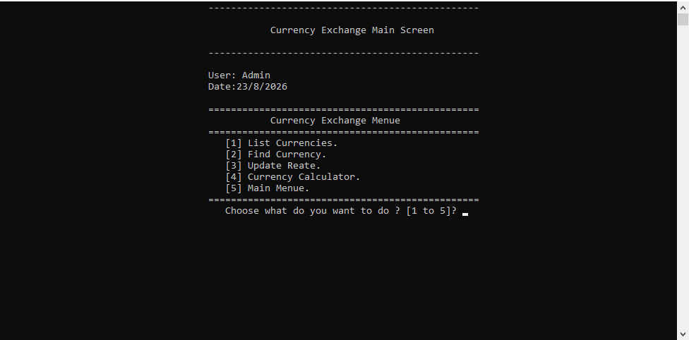

# Bank Management System

A console-based Bank Management System developed in C++ as a practical project to apply Object-Oriented Programming (OOP), problem solving, file handling, and application design concepts.

## Screenshots

### Login Screen

### Main Menu

### Transactions

### Currency Exchange

## Features

- Client management
  - Add clients
  - Update client information
  - Delete clients
  - Search for clients
  - Display client list

- Banking transactions
  - Deposit
  - Withdraw
  - View total balances
  - Transfer money between accounts

- User management
  - Add users
  - Update users
  - Delete users
  - Search for users

- Permission-based access control

- Login activity records

- Transfer transaction logs

- Currency management
  - List currencies
  - Search currencies
  - Update exchange rates
  - Currency calculator

## Technologies & Concepts

- C++
- Object-Oriented Programming (OOP)
- Inheritance
- Encapsulation
- File Handling
- Problem Solving
- Classes and Objects
- Reusable Components
- Console Application Development

## Data Storage

The application currently uses text files for storing clients, users, currencies, login records, and transfer logs.

This project is intended for learning and practicing software development concepts and is not designed for production banking use.

## Project Structure

The project is organized into separate classes for:

- Clients
- Users
- Banking transactions
- Transfers
- Currencies
- Input validation
- Dates and utilities
- Application screens

## Getting Started

1. Clone the repository.
2. Open `Bank.sln` using Visual Studio.
3. Build the solution.
4. Run the application.

## Future Improvements

- Replace text-file storage with a database.
- Improve credential and authentication handling.
- Add automated testing.
- Improve error handling and validation.
- Apply additional software architecture principles as my development skills progress.

## Author

**Nabil Alansari**

Application Development Graduate  
Currently continuing my software development learning journey with a focus on building strong programming fundamentals and practical projects.